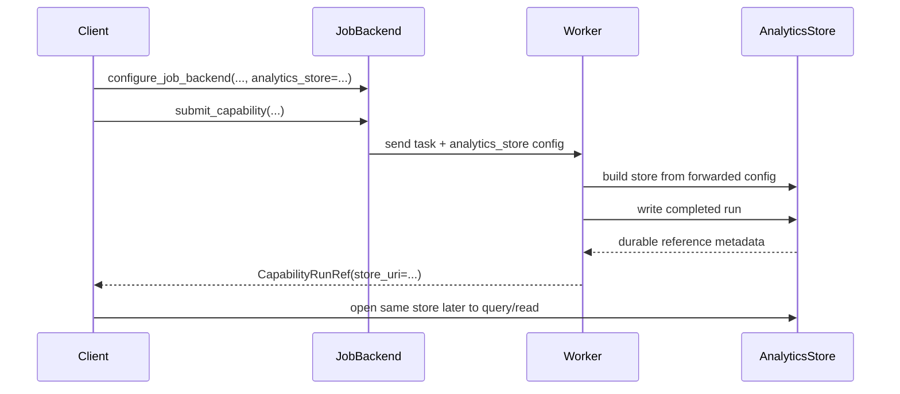

# Analytics store in distributed execution

The analytics store is straightforward in a single-process workflow:

1. run a capability,
2. write records,
3. query them later from the same environment.

Distributed execution makes that more subtle because compute and orchestration no
longer run in the same process.

## Why distributed execution changes the problem

In local synchronous execution, the process that computes the run also already
knows:

- where the analytics store lives,
- how to write to it,
- and how to read it back later.

In distributed job submission, those responsibilities are split:

- the **client** chooses the durable store location,
- the **worker** needs that information so it can persist results,
- and the **client** later needs a stable way to find the data that the worker
  wrote.

That is why `configure_job_backend(...)` requires explicit analytics-store
configuration:

```python
configure_job_backend(
    "ray",
    analytics_store={
        "backend": "parquet",
        "uri": "./analytics_store",
    },
)
```

The job backend forwards that store configuration to worker tasks. Workers then
build their own `AnalyticsStore` instance from the forwarded config rather than
guessing a local default.

For a focused `configure_job_backend(...)` reference, see
[Job backend configuration](configure_job_backend.md).

## End-to-end store flow



The key point is that **store configuration is part of job submission semantics**,
not an incidental local default.

## What job submission expects from the store

The job-submission layer relies on a few store-level properties:

- workers can construct the store from the forwarded configuration,
- completed run data is written durably before a job reports success,
- repeated writes for the same logical completed run are safe,
- the worker can return a stable `CapabilityRunRef`, including `store_uri`, and
- the client can later use the same store location to query or read results.

Backend-specific storage mechanics, table layouts, deduplication keys, and
concurrency guarantees belong to the analytics-store backend implementation.

## Storage visibility matters

In a single-machine workflow, it is easy to forget that "where results are
written" is itself configuration. Once workers run remotely, that assumption
breaks down:

- a node-local default path may not be durable,
- a worker-local filesystem path may be meaningless to the client,
- and different machines may not share the same storage namespace.

Distributed execution therefore requires two explicit decisions:

1. **where workers should write**, and
2. **how the client should later identify the written result**.

The current job-submission path solves that by forwarding the configured
analytics store to workers and returning a `CapabilityRunRef` only after the
worker write succeeds.

## Failure policy

The analytics store is the durable system of record for completed job results.
That is why the current policy is strict:

- worker-side analytics-store write happens before success is returned,
- if the store write fails, the task fails,
- and the client observes `JobFailedError` rather than a silent partial success.

A successful job should imply that durable analytics-store persistence succeeded.
