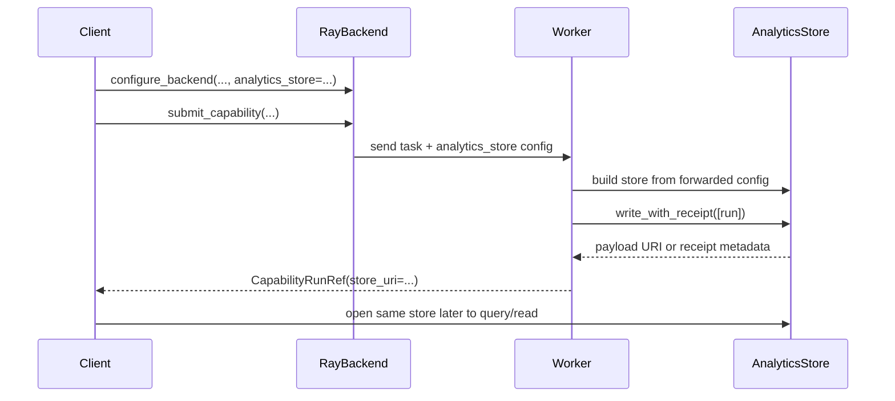

# Analytics store in distributed execution

The analytics store is straightforward in a single-process workflow:

1. run a capability,
2. write records,
3. query them later from the same environment.

Distributed execution makes that more subtle, because compute and orchestration are no longer in the same process.

## Why distributed execution changes the problem

In local synchronous execution, the process that computes the run also already knows:

- where the analytics store lives,
- how to write to it,
- and how to read it back later.

In distributed job submission, those responsibilities are split:

- the **client** chooses the durable store location,
- the **worker** needs that information so it can persist results,
- and the **client** later needs a stable way to find the payload data that the worker wrote.

That is why `configure_backend(...)` requires explicit analytics-store configuration:

```python
configure_backend(
    "ray",
    analytics_store={
        "backend": "parquet",
        "uri": "./analytics_store",
    },
)
```

The backend forwards that store configuration to worker tasks. Workers then build their own `AnalyticsStore` instance from the forwarded config rather than guessing a local default.

For a focused `configure_backend(...)` reference (including the producer/consumer handoff path), see [Backend configuration](configure_backend.md).

## Current end-to-end store flow



The key point is that **store configuration is part of job submission semantics**, not an incidental local default.

## What the writer must enforce: idempotency

The analytics store is expected to behave idempotently across repeated writes.

In the current code that means:

- **payload tables** are deduplicated by `run_uid` across repeated writes,
- the auto-generated **`runs` table** is deduplicated by
  `(run_uid, capability_table, entity_type, entity_id)`.

That behavior matters for notebook reruns, retries, and repeated submission of the same logical run.

### Current `AnalyticsStore` expectations

`AnalyticsStore.write()` assumes that each run's `extract()` output belongs to exactly **one payload table**. This is a table-shape invariant used to infer the single `capability_table` value for the auto-generated `runs` rows. It is **not** where payload deduplication happens.

The store then:

1. collects the payload records,
2. infers the payload table name,
3. auto-generates matching `runs` rows,
4. and sends all of that to the storage backend.

## What the Parquet backend does today

The current Parquet backend enforces idempotency at write time by checking existing files before writing new ones.

### Payload tables

For payload tables, repeated writes with the same `run_uid` are suppressed.

### `runs` table

For the `runs` table, repeated writes of the same `(run_uid, capability_table, entity_type, entity_id)` mapping are suppressed.

This gives good behavior for the normal retry / re-execution case, while still allowing distinct entity mappings for the same run.

## Important nuance: this is not a transactional distributed lock

The current Parquet backend is a file-based backend. It deduplicates against data that is already visible in storage. That works well for repeated writes over time.

It is **not** a database transaction manager and does not provide a cluster-wide write lock for the same `run_uid`.

So the right interpretation is:

- it enforces the idempotency policy of the current backend implementation,
- but it is not pretending to be a fully transactional multi-writer system.

If stronger concurrency guarantees are needed later, they should come from the storage backend itself (for example, a backend with database constraints or upsert semantics).

## How `store_uri` is resolved

Jobs return a `CapabilityRunRef`, which includes `store_uri`.

Current semantics:

- `store_uri` points to a **payload object**,
- it is a plain path/URI,
- and the auto-generated `runs` table is intentionally excluded from canonical payload resolution.

### Receipt-first resolution

When a worker writes a run, the store uses `write_with_receipt(...)` to get concrete write metadata for that call.

That receipt tracks payload objects written for each `run_uid`.

If the current write created a new payload object, the worker can resolve `store_uri` directly from the receipt.

### Fallback resolution

If no new payload object was written — for example because the payload table deduplicated an already-existing `run_uid` — the worker falls back to `store.get_run_uri(run_uid)`.

That is how repeated submissions can still return a useful payload URI without duplicating data.

## Why this communication step is new in distributed mode

In a single-machine workflow, it is easy to forget that "where results are written" is itself configuration.

Once workers run remotely, that assumption breaks down:

- a node-local default path may not be durable,
- a worker-local filesystem path may be meaningless to the client,
- and different machines may not even share the same storage namespace.

So distributed execution requires two explicit decisions:

1. **where workers should write**, and
2. **how the client should later identify the written payload**.

The current implementation solves that by:

- requiring explicit `analytics_store` configuration at backend setup time,
- forwarding that config to workers,
- and returning `store_uri` in `CapabilityRunRef` once the write succeeds.

## Failure policy

The analytics store is the durable system of record for job submission.

That is why the current policy is strict:

- worker-side analytics-store write happens before success is returned,
- if the store write fails, the task fails,
- and the client observes `JobFailedError` rather than a silent partial success.

This is an intentional design choice. A successful job should imply that durable analytics-store persistence succeeded.

## Current backend support

For jobs, the forwarded analytics-store config currently supports:

- backend: `"parquet"`
- required field: `uri`
- optional field: `storage_options`

That is the current code contract documented by `AnalyticsStoreConfig`.
