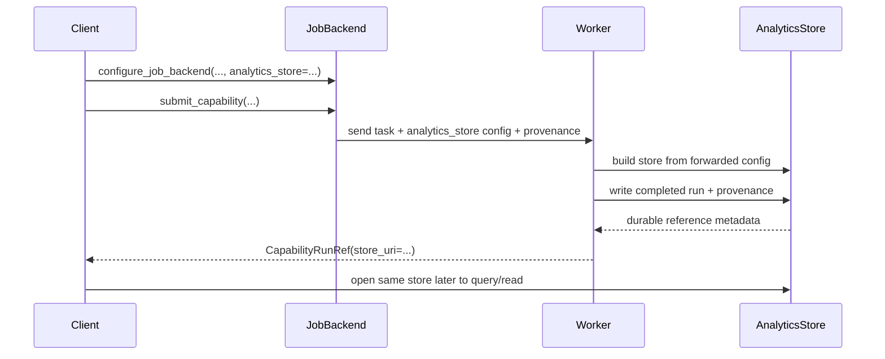

# Analytics store in distributed execution

The analytics store is straightforward in a single-process workflow:

1. run a capability,
2. write records,
3. query them later from the same environment.

Distributed execution makes that more subtle because compute and orchestration no
longer run in the same process.

## Why distributed execution changes the problem

In local synchronous execution, the process that computes the run also already
knows:

- where the analytics store lives,
- how to write to it,
- and how to read it back later.

In distributed job submission, those responsibilities are split:

- the **client** chooses the durable store location,
- the **worker** needs that information so it can persist results,
- and the **client** later needs a stable way to find the data that the worker
  wrote.

That is why `configure_job_backend(...)` requires explicit analytics-store
configuration:

```python
configure_job_backend(
    "ray",
    analytics_store={
        "backend": "parquet",
        "uri": "./analytics_store",
    },
)
```

The job backend forwards that store configuration to worker tasks. Workers then
build their own `AnalyticsStore` instance from the forwarded config rather than
guessing a local default. The backend also forwards provenance metadata so the
`runs` table records the job that produced each persisted run.

For a focused `configure_job_backend(...)` reference, see
[Job backend configuration](configure_job_backend.md).

## End-to-end store flow



The key point is that **store configuration is part of job submission semantics**,
not an incidental local default.

## What job submission expects from the store

The job-submission layer relies on a few store-level properties:

- workers can construct the store from the forwarded configuration,
- non-empty completed run data is written durably before a job reports success,
- repeated writes for the same logical completed run are safe,
- the worker can return a stable `CapabilityRunRef`, with `store_uri` set when analytics rows exist, and
- the client can later use the same store location to query or read results.

Backend-specific storage mechanics, table layouts, deduplication keys, and
concurrency guarantees belong to the analytics-store backend implementation.

## Provenance in run history

Provenance answers basic production questions about run history: who submitted a
run, which workspace it belonged to, where it executed, which job produced it,
and when it was submitted and completed. This is most useful in shared or
production job-submission workflows where the process that writes results may be
different from the person or service that later queries them.

For local use, provenance can usually be ignored. If no provenance is passed,
local writes keep the same idempotent behavior as before; the `runs` table simply
has additional nullable columns.

The analytics store persists provenance on the auto-generated `runs` table. The
columns are flat scalar fields so they can be filtered with SQL and stored in the
current Parquet backend:

- `user_id`, `workspace_id`
- `job_id`, `backend`
- `submitted_at`, `completed_at`
- `environment`, `executor`, `cluster_id`, `request_id`
- `run_event_id`

Processes can configure static defaults once and pass them to local writes:

```python
from checkmaite import configure_provenance, get_provenance_defaults

configure_provenance(
    user_id="alice@company.com",
    workspace_id="workspace-ml-team-a",
    environment="databricks",
    executor="ray",
    cluster_id="cluster-42",
    request_id="req-123",
)

store.write([run], provenance=get_provenance_defaults())
```

Calling `configure_provenance()` with no arguments resets the mutable defaults.
It intentionally accepts only static identity/environment fields. Local store
writes use only provenance passed to `store.write(..., provenance=...)`; process
defaults are not read automatically. Per-run-event fields such as `job_id`,
`backend`, timestamps, and `run_event_id` should be passed explicitly or
populated by a job backend. Timestamp fields must be timezone-aware; CheckMATE
normalizes them to UTC before writing.

At process startup, these same static fields are initialized from environment
variables when present:

| Field | Environment variable |
| --- | --- |
| `user_id` | `CHECKMAITE_PROVENANCE_USER_ID` |
| `workspace_id` | `CHECKMAITE_PROVENANCE_WORKSPACE_ID` |
| `environment` | `CHECKMAITE_PROVENANCE_ENVIRONMENT` |
| `executor` | `CHECKMAITE_PROVENANCE_EXECUTOR` |
| `cluster_id` | `CHECKMAITE_PROVENANCE_CLUSTER_ID` |
| `request_id` | `CHECKMAITE_PROVENANCE_REQUEST_ID` |

Environment-provided values are preserved by
`configure_provenance()`/`reset_provenance()` for the lifetime of the process.
Explicit store-write provenance is treated as already resolved and is written as
provided.

For distributed jobs, the submitter process resolves these defaults and sends the
resulting provenance with the worker task. Worker-side writes use that submitted
provenance rather than reinterpreting it against the worker process environment.

Job backends merge these static defaults with dynamic metadata. The Ray backend
sets `job_id`, `backend="ray"`, `submitted_at`, `completed_at`, and uses the job
ID as `run_event_id`; if no `workspace_id` default is configured, the Ray
`idempotency_scope` is recorded as the workspace.

### Data classification and retention

Provenance values are written as plain columns in append-only Parquet files.
Avoid storing sensitive personal data directly in fields such as `user_id` or
`request_id`; prefer opaque service IDs, pseudonymous IDs, or hashed identifiers
when possible. Plan retention and erasure procedures at the storage layer because
analytics-store writes do not encrypt, redact, or delete historical rows.

Payload tables and run history have separate deduplication semantics:

- payload tables remain idempotent by `run_uid`, so repeated writes do not create
  duplicate payload artifacts;
- `runs` preserves local idempotency by deduplicating rows without
  `run_event_id` by `(run_uid, capability_table, entity_type, entity_id)`;
- rows with explicit `run_event_id` are deduplicated by
  `(run_uid, capability_table, entity_type, entity_id, run_event_id)`, so job
  submissions and other explicit run events of the same logical run can retain
  distinct provenance.

## Storage visibility matters

In a single-machine workflow, it is easy to forget that "where results are
written" is itself configuration. Once workers run remotely, that assumption
breaks down:

- a node-local default path may not be durable,
- a worker-local filesystem path may be meaningless to the client,
- and different machines may not share the same storage namespace.

Distributed execution therefore requires two explicit decisions:

1. **where workers should write**, and
2. **how the client should later identify the written result**.

The current job-submission path solves that by forwarding the configured
analytics store to workers and returning a `CapabilityRunRef` only after the
worker write succeeds.

## Failure policy

The analytics store is the durable system of record for completed job results.
That is why the current policy is strict:

- worker-side analytics-store write happens before success is returned,
- if the store write fails, the task fails,
- and the client observes `JobFailedError` rather than a silent partial success.

A successful job should imply that durable analytics-store persistence succeeded.
