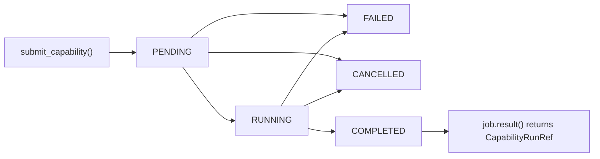

# Job protocol and lifecycle

The jobs protocol gives `checkmaite` a small, backend-agnostic contract for asynchronous execution.

Instead of coupling notebooks and higher-level APIs directly to backend-specific primitives, the codebase defines a common shape for:

- submission,
- lifecycle status,
- waiting and cancellation,
- error mapping,
- and result payloads.

That contract is implemented today by the available job backends, but it is deliberately phrased as a protocol so other backends can adopt the same semantics later.

## Why a protocol is useful

A protocol buys us three things.

### 1. Stable user-facing semantics

Notebook code can work with `Job[CapabilityRunRef]` rather than job-backend-specific objects. That means callers can rely on:

- `job.status`
- `job.wait(timeout=...)`
- `job.result(timeout=...)`
- `job.cancel()`
- `job.exception()`

without knowing how those behaviors are implemented underneath.

### 2. Thin job backend wrappers

The job backend only needs to map its native state model onto the shared `JobStatus` and exception contracts. The public API remains small enough to implement without building a custom scheduler abstraction.

### 3. Room for additional job backends later

The current code uses Ray-backed implementations, but the protocol is what makes future implementations plausible:

- a different Ray submission style,
- a platform-specific scheduler,
- or a local background executor.

The point is not that those exist today. The point is that the rest of `checkmaite` does not need to be rewritten if they appear.

## Why `result()` is reference-first

In distributed execution, returning the full `CapabilityRunBase` payload by default is expensive and fragile:

- the run object may be large,
- worker-to-client serialization can be expensive,
- the data may already be written durably elsewhere,
- and the client often only needs enough information to inspect status, locate durable results, or render a lightweight summary.

So the current contract is intentionally **reference-first**:

- the backend runs the capability asynchronously,
- result data is persisted outside the job handle,
- the job returns a small `CapabilityRunRef`,
- and any future full-payload loading can be added explicitly rather than implicitly.

In practice, `CapabilityRunRef` contains:

- `run_uid`
- `capability_id`
- `store_uri` (`None` when the run produced no analytics rows)
- `outputs_uri` (`None` today)
- `report` (a typed `InlineTextReport` or `ArtifactReport`, or `None` for runs without reporting)

Inline reports carry their media type, filename, and textual content directly
in job metadata. Their UTF-8 content is limited to 256 KiB. Links to
worker-local files cannot be resolved by clients on another node; some current
Markdown reports still contain local image paths, which is a known limitation.
Report consumers should not assume those images are remotely available. Large,
binary, or multi-file reports should use a durable artifact URI. `store_uri`
remains dedicated to analytics data and is absent for successful zero-row
results. Report producers are responsible for creating the artifact and making
its URI accessible to the consumer.

Storage semantics and URI resolution are documented in [Distributed analytics store](analytics_store.md).

## Cache semantics

Job submission intentionally disables capability-local cache usage. Calls with
`use_cache=True` are rejected before work is submitted, and workers execute
capabilities with `use_cache=False`. A worker may be a short-lived process on a
different node or container, so its local cache is not a reliable shared cache
for clients or other workers.

For repeated submitted work, rely on backend-level idempotency/dedupe (where the
backend supports it) and durable analytics-store outputs. Any future shared cache
support should be configured as an explicit remote cache backend rather than by
using worker-local cache state.

## Lifecycle

### Interpretation

- `PENDING` means the work has been submitted but has not yet resolved to a terminal outcome.
- `RUNNING` means the work is in progress from the client handle's point of view.
- `COMPLETED`, `FAILED`, and `CANCELLED` are terminal states.

The shared `JobStatus` enum is intentionally small. Backends can derive those states however they like, but they should present the same lifecycle semantics to callers.

## Errors and waiting

The protocol also standardizes how failures are exposed:

- `JobTimeoutError` — the caller waited too long
- `JobCancelledError` — the job was cancelled
- `JobFailedError` — the remote work failed
- `BackpressureError` — the backend control plane is overloaded and the caller should retry with backoff

This lets notebook code write one error-handling path even if job backends change.
