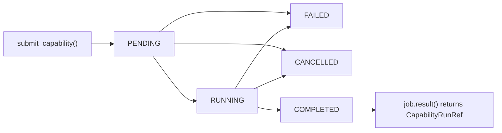

# Job protocol and lifecycle

The jobs protocol gives `checkmaite` a small, backend-agnostic contract for asynchronous execution.

Instead of coupling notebooks and higher-level APIs directly to Ray primitives, the codebase defines a common shape for:

- submission,
- lifecycle status,
- waiting and cancellation,
- error mapping,
- and result payloads.

That contract is implemented today by the Ray job backend, but it is deliberately phrased as a protocol so other backends can adopt the same semantics later.

## Why a protocol is useful

A protocol buys us three things.

### 1. Stable user-facing semantics

Notebook code can work with `Job[CapabilityRunRef]` rather than backend-specific objects. That means callers can rely on:

- `job.status`
- `job.wait(timeout=...)`
- `job.result(timeout=...)`
- `job.cancel()`
- `job.exception()`

without knowing how those behaviors are implemented underneath.

### 2. Thin backend wrappers

The backend only needs to map its native state model onto the shared `JobStatus` and exception contracts. The public API remains small enough to implement without building a custom scheduler abstraction.

### 3. Room for additional backends later

The current code uses Ray Core, but the protocol is what makes future implementations plausible:

- a different Ray submission style,
- a platform-specific scheduler,
- or a local background executor.

The point is not that those exist today. The point is that the rest of `checkmaite` does not need to be rewritten if they appear.

## Why `result()` is reference-first

In distributed execution, returning the full `CapabilityRunBase` payload by default is expensive and fragile:

- the run object may be large,
- worker-to-client serialization can be expensive,
- the data may already be written durably elsewhere,
- and the client often only needs enough information to inspect status, locate durable results, or render a lightweight summary.

So the current contract is intentionally **reference-first**:

- the worker runs the capability,
- the worker writes analytics-store records,
- the job returns a small `CapabilityRunRef`,
- and any future full-payload loading can be added explicitly rather than implicitly.

In practice, `CapabilityRunRef` contains:

- `run_uid`
- `capability_id`
- `store_uri`
- `outputs_uri` (`None` today)
- `summary` (small human-readable data such as markdown report content)

## Lifecycle



### Interpretation

- `PENDING` means the work has been submitted but has not yet resolved to a terminal outcome.
- `RUNNING` means the work is in progress from the client handle's point of view.
- `COMPLETED`, `FAILED`, and `CANCELLED` are terminal states.

The shared `JobStatus` enum is intentionally small. Backends can derive those states however they like, but they should present the same lifecycle semantics to callers.

## Errors and waiting

The protocol also standardizes how failures are exposed:

- `JobTimeoutError` — the caller waited too long
- `JobCancelledError` — the job was cancelled
- `JobFailedError` — the remote work failed

This lets notebook code write one error-handling path even if execution backends change.

## Why analytics-store handling is harder in distributed execution

The analytics store is the part of the protocol that becomes more subtle once compute moves off the client machine.

In the single-machine synchronous case, the same process can:

1. run the capability,
2. decide where to write records,
3. and immediately know where those records live.

In distributed job submission, those responsibilities split across machines:

- the **client** chooses the durable store location,
- the **worker** needs that configuration so it knows where to write,
- and the **client** later needs a stable way to find the data that the worker wrote.

That is why the current API requires explicit analytics-store configuration at backend setup time:

```python
configure_job_backend(
    "ray",
    analytics_store={"backend": "parquet", "uri": "./analytics_store"},
)
```

The worker receives that store configuration, writes the run, and returns a `store_uri` pointing at the payload object that now contains the run's durable data.

If you want the code-level walkthrough that exercises all of this behavior, see the [Job Submission Walkthrough notebook](../job_submission_walkthrough.ipynb).
