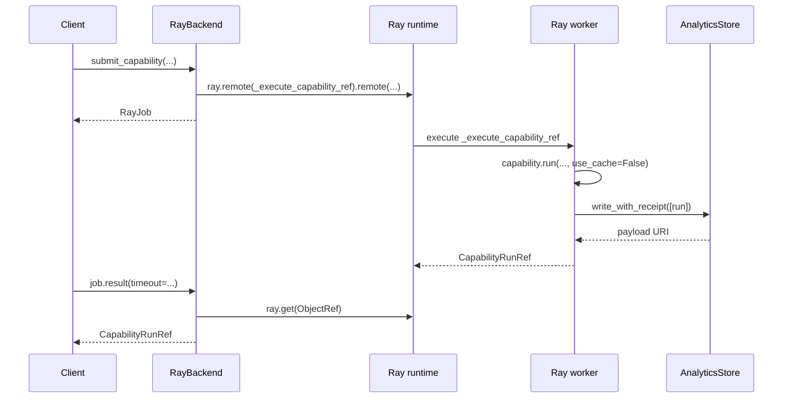

# Ray backend

The current job backend uses **Ray Core**.

This page explains why Ray is a good fit, how the backend maps onto Ray's execution model, and how to use it from `checkmaite`.

## Why Ray

Ray is a distributed Python runtime designed for:

- task-parallel execution,
- actor-based stateful services,
- dynamic CPU/GPU scheduling,
- and the ability to run the same code on a laptop or a cluster.

That lines up well with `checkmaite`'s needs:

- notebook users want to submit work without blocking,
- capabilities may need CPUs or GPUs,
- development should work locally,
- and the same API should scale to larger infrastructure when available.

## Ray's execution model in one paragraph

At the Ray Core level, distributed computation is built from a few primitives:

- `ray.init(...)` connects to or starts a Ray runtime,
- `ray.remote(...)` turns a Python function or class into distributed work,
- calling `.remote(...)` submits that work and returns an `ObjectRef`,
- `ray.get(...)` waits for the value,
- `ray.wait(...)` checks whether it is ready,
- and `ray.cancel(...)` requests cancellation.

The current `checkmaite` backend uses one **Ray task** per submitted capability run and wraps the returned `ObjectRef` in a thin `RayJob` object.

## Why `checkmaite` uses Ray Core

Ray offers multiple ways to launch distributed work. The current implementation uses **Ray Core** rather than a higher-level jobs service because the primary target is still interactive Python workflows.

Ray Core is a good baseline here because it gives us:

- direct callable submission from notebooks,
- simple local development with `address="local"`,
- cluster execution without changing the public `checkmaite` API,
- and minimal scheduler glue.

## End-to-end flow



Two details matter here:

1. job submission does **not** consult the notebook process' local cache before submission;
2. worker execution currently forces `use_cache=False`, because the backend does not yet assume a remote/shared cache that every worker can safely read.

## Public usage

### 1. Configure the backend

```python
from checkmaite.jobs import configure_backend

configure_backend(
    "ray",
    address="local",
    analytics_store={"backend": "parquet", "uri": "./analytics_store"},
)
```

Important:

- `analytics_store=...` is required,
- it is separate from Ray connection/runtime settings,
- and it is forwarded to worker tasks so they know where durable results should be written.

### 2. Submit work

```python
from checkmaite.jobs import submit_capability

job = submit_capability(
    capability,
    datasets=[dataset],
    models=[model],
    metrics=[metric],
    config=config,
    use_cache=True,
)
```

Even when `use_cache=True`, the current backend still submits the work remotely. The worker then executes with `use_cache=False`.

### 3. Inspect lifecycle and retrieve the result reference

```python
print(job.job_id)
print(job.status)
print(job.wait(timeout=0.1))

ref = job.result(timeout=300)
print(ref.run_uid)
print(ref.store_uri)
print(ref.outputs_uri)  # None today
```

The returned object is `CapabilityRunRef`, not a full `CapabilityRunBase`.

## Resource scheduling

The backend resolves CPU/GPU requirements in the following order:

1. explicit `resources={...}` passed at submission time,
2. hints on the config object (`config.num_cpus`, `config.num_gpus`),
3. capability defaults (`default_num_cpus`, `default_num_gpus`),
4. fallback (`num_cpus=1`, `num_gpus=0`).

Example:

```python
job = submit_capability(
    capability,
    datasets=[dataset],
    resources={"num_cpus": 4, "num_gpus": 1},
)
```

## Status mapping

`RayJob` is intentionally a thin wrapper. It translates Ray observations into `checkmaite` lifecycle states:

- `ray.wait(..., timeout=0)` not ready -> `PENDING` on the first poll, then `RUNNING`
- `ray.get(...)` returns successfully -> `COMPLETED`
- `TaskCancelledError` -> `CANCELLED`
- other exceptions -> `FAILED`

The current implementation keeps this state locally in the notebook process. It is not a cluster-wide registry.

## Timeouts and cancellation

```python
from checkmaite.jobs import JobTimeoutError

try:
    ref = job.result(timeout=120)
except JobTimeoutError:
    job.cancel()
    raise
```

Notes:

- `job.result(timeout=...)` is a client-side wait timeout,
- timing out does **not** automatically cancel the remote task,
- `job.cancel()` calls `ray.cancel(...)`,
- and the current handle then treats the job as cancelled.

## Reconfiguration semantics

`configure_backend(...)` supports non-blocking handoff by default.

### Default behavior

```python
configure_backend(
    "ray",
    address="local",
    analytics_store={...},
)
```

If a backend is already active, `configure_backend(...)` calls `shutdown(wait=False)` on it first. That means:

- the call does **not** block on tracked jobs,
- the current Ray runtime is not torn down,
- and new `address` / `runtime_env` settings may be ignored if Ray is already initialized.

### Force a true reconnect

```python
configure_backend(
    "ray",
    address="ray://cluster-head:10001",
    runtime_env={...},
    force_reinit=True,
    analytics_store={...},
)
```

Use `force_reinit=True` when you need new Ray connection or runtime-environment settings to actually apply.
