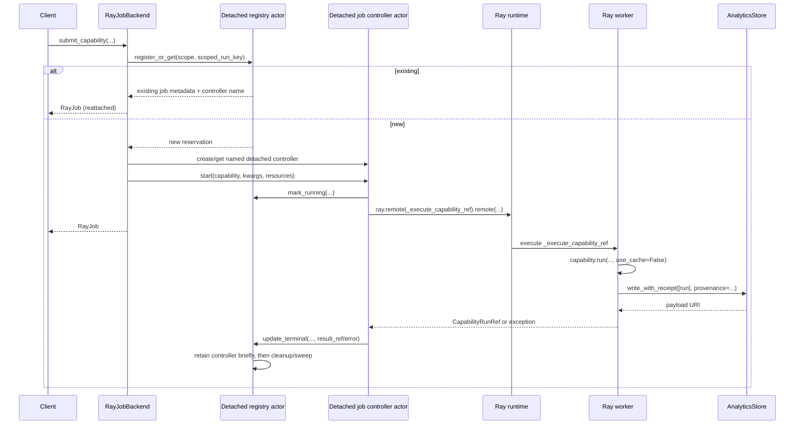

# Ray job backend (`kind="ray"`)

The default Ray job backend uses **Ray Core** with a detached registry actor and detached per-job controller actors.

This page explains why Ray is a good fit, how the default `"ray"` job backend maps onto Ray's execution model, and how to use it from `checkmaite`. For the direct process-local Ray task-based job backend, see [Ray simple job backend](ray_simple_job_backend.md).

## Why Ray

Ray is a distributed Python runtime designed for:

- task-parallel execution,
- actor-based stateful services, where an actor is a named Python object that keeps state across remote method calls,
- and dynamic CPU/GPU scheduling.

That lines up well with `checkmaite`'s needs:

- notebook users want to submit work without blocking,
- capabilities may need CPUs or GPUs,
- development should work locally while the same API scales to larger infrastructure when available.

## Ray's execution model in one paragraph

At the Ray Core level, distributed computation is built from a few primitives:

- `ray.init(...)` connects to or starts a Ray runtime,
- `ray.remote(...)` turns a Python function or class into distributed work,
- calling `.remote(...)` submits that work and returns an `ObjectRef`,
- `ray.get(...)` waits for the value,
- `ray.wait(...)` checks whether it is ready,
- and `ray.cancel(...)` requests cancellation.

The current `checkmaite` job backend uses one **detached per-job controller actor** plus one **Ray task** per submitted capability run. The controller actor owns the live `ObjectRef`, while the public `RayJob` handle reads shared lifecycle metadata from the registry.

## End-to-end flow



The registry/controller split is the key design shown in the flow:

1. The **registry actor** is the shared directory for job metadata. `register_or_get(...)` either reserves a new job ID or returns an existing record for the same scoped run key. Later `get_job(...)` and `list_jobs(...)` calls read from this registry, so clients do not need the original submitting process to still be alive.
2. The **controller actor** is the per-job owner of live execution. After the registry accepts a new reservation, the backend creates or finds the named detached controller, asks it to mark the job `RUNNING`, and the controller launches the Ray worker task.
3. The **controller owns the Ray task `ObjectRef`**, not the notebook/client. It watches the task complete, handles cancellation requests, and writes terminal status plus the serialized `CapabilityRunRef` back to the registry.
4. The public `RayJob` handle is therefore a lightweight client-side view over shared registry state and, while the controller is retained, controller reconciliation/cancellation methods.

## Public usage

### 1. Configure the job backend

```python
from checkmaite.jobs import configure_job_backend

configure_job_backend(
    "ray",
    address="local",
    analytics_store={"backend": "parquet", "uri": "./analytics_store"},
    idempotency_scope="team-a-notebooks",
    registry_namespace="checkmaite_jobs",
)
```

Important:

- `analytics_store=...` is required,
- `idempotency_scope=...` is required and has no default,
- capability-local caching is disabled in job submission mode; `use_cache=True`
  is rejected because Ray workers are ephemeral and do not share a local cache,
- the scope should be a stable workspace, project, or experiment identifier,
- analytics-store configuration is separate from Ray connection/runtime settings,
- and it is forwarded to worker tasks so they know where durable results should be written.
- submission is deduplicated by `(idempotency_scope, scoped_run_key)`, and
  `get_job(job_id)` / `list_jobs()` can reattach across client restarts as
  long as the same actor identity and scope are reused.
- worker-side analytics-store writes include provenance resolved on the
  submitter plus dynamic job metadata: `job_id`, `backend="ray"`,
  `submitted_at`, `completed_at`, and `run_event_id=job_id`.

### 2. Configure provenance defaults, if needed

```python
from checkmaite import configure_provenance

configure_provenance(
    user_id="alice@company.com",
    workspace_id="team-a-notebooks",
    environment="ray-cluster-prod",
    executor="ray",
    cluster_id="cluster-42",
    request_id="req-123",
)
```

These defaults are optional and process-wide. On submission, the Ray backend
reads them from the client process with `get_provenance_defaults()`, merges in
registry-assigned job metadata (`job_id`, `submitted_at`) plus backend metadata
(`backend="ray"`, `run_event_id=job_id`), and includes that resolved provenance
in the kwargs sent to the controller.

The controller passes that provenance to the worker task with the rest of the
submission payload. It may add or carry controller/job metadata, but it does not
ask the worker to recompute client defaults. After `capability.run(...)`
finishes, the worker adds `completed_at` and passes the final provenance
explicitly to `write_with_receipt(...)`. The auto-generated `runs` rows then
persist those values as flat columns.

### 3. Submit work

```python
from checkmaite.jobs import submit_capability

job = submit_capability(
    capability,
    datasets=[dataset],
    models=[model],
    metrics=[metric],
    config=config,
    use_cache=False,
)
```

`use_cache=False` is not just a recommendation: job submission rejects
`use_cache=True`. Worker-local caches are ephemeral and are not shared with the
client or other workers. Reuse in this backend comes from registry dedupe for the
same `(idempotency_scope, scoped_run_key)` and durable analytics-store writes;
future shared-cache support would need an explicit remote cache backend.

### 4. Inspect lifecycle and retrieve the result reference

```python
print(job.job_id)
print(job.status)
print(job.wait(timeout=0.1))

ref = job.result(timeout=300)
print(ref.run_uid)
print(ref.store_uri)
print(ref.outputs_uri)  # None today
```

The returned object is `CapabilityRunRef`, not a full `CapabilityRunBase`.

### 5. List jobs

```python
from checkmaite.jobs import JobStatus, list_jobs

recent = list_jobs(limit=100)
completed = list_jobs(limit=50, status_filter=JobStatus.COMPLETED)
```

`list_jobs(...)` is intentionally limited/paginated. The registry applies
filters and limits before copying records back to the client. Handles returned
from listing are attached to the current backend instance, so `shutdown(wait=True)`
treats them as tracked jobs. Use `before_submitted_at_ts` as a simple cursor for
older pages.

## Resource scheduling

The job backend resolves CPU/GPU requirements in the following order:

1. explicit `resources={...}` passed at submission time,
2. hints on the config object (`config.num_cpus`, `config.num_gpus`),
3. capability defaults (`default_num_cpus`, `default_num_gpus`),
4. fallback (`num_cpus=1`, `num_gpus=0`).

Example:

```python
job = submit_capability(
    capability,
    datasets=[dataset],
    resources={"num_cpus": 4, "num_gpus": 1},
)
```

## Status mapping

`RayJob` is a thin protocol wrapper over shared registry lifecycle state.

Primary mapping comes from registry state:

- `SUBMITTING` -> `PENDING`
- `RUNNING` / `CANCELLING` -> `RUNNING`
- `COMPLETED` -> `COMPLETED`
- `FAILED` -> `FAILED`
- `CANCELLED` -> `CANCELLED`

`RayJob` does not own or use the live task `ObjectRef` directly. The detached
controller owns that reference. Client handles resolve terminal payloads from
registry metadata (`result_ref`) and ask the controller to reconcile registry
state from its owned task when needed.

## Timeouts and cancellation

```python
from checkmaite.jobs import JobTimeoutError

try:
    ref = job.result(timeout=120)
except JobTimeoutError:
    job.cancel()
    raise
```

Notes:

- `job.result(timeout=...)` is a client-side wait timeout,
- timing out does **not** automatically cancel the remote task,
- `job.cancel()` records shared cancellation intent (`CANCELLING`) and asks the
  detached controller actor to call `ray.cancel(...)` when the controller is reachable,
- `CANCELLING` still maps to public `RUNNING` until the controller observes and
  commits a terminal state,
- if the cancellation request is dispatched but the acknowledgement times out,
  `cancel()` may return `True` even though final cancellation is still pending,
- if the controller cannot be reached, cancellation returns `False` because the
  handle cannot prove that the underlying Ray task stopped,
- if the controller has already been cleaned up then the job is already terminal
  and cancellation is a no-op.

## Shutdown semantics

`RayJobBackend.shutdown(wait=True)` waits for jobs attached to that backend
instance and then calls `ray.shutdown()` for the local client process.

`RayJobBackend.shutdown(wait=False)` is intentionally a non-blocking local-handle
handoff: it does not wait for jobs and does not call `ray.shutdown()`. This is
used by `configure_job_backend(...)` when replacing the active backend so running
detached controllers can continue in the Ray cluster and a new backend can
reattach to them. Call `ray.shutdown()` explicitly, or use `shutdown(wait=True)`,
when you really want to disconnect the local Ray runtime.

## Registry configuration notes

Keep `registry_namespace` and `idempotency_scope` stable across sessions if you
want reattach behavior. By default, the registry actor name is a deterministic
hash of `idempotency_scope`, which avoids accidental collisions between unrelated
teams on the same Ray cluster. Pass `registry_actor_name` explicitly only when
clients should intentionally share one registry actor across scopes.

Different scopes intentionally do not dedupe with each other.

### Pending-call limits and backpressure

The registry is a single serialized actor, so queued registry calls should be
bounded. By default, `registry_max_pending_calls=1024` caps queued calls on each
registry actor handle and `controller_max_pending_calls=64` caps queued calls on
each per-job controller actor handle. These limits protect the Ray control plane
from unbounded memory growth during bursty submits, polling, or cancellation.

If Ray rejects a call because an actor pending-call limit is full, client APIs
raise `BackpressureError`. Treat that as a retryable overload signal: retry with
exponential backoff and jitter, reduce client-side concurrency, or tune
`registry_max_pending_calls` / `controller_max_pending_calls` for expected burst
size. Higher limits absorb larger bursts but increase memory use and tail
latency; lower limits fail fast and protect the registry/controller actors.
Passing `None` opts back into Ray's unbounded pending-call behavior and should be
reserved for controlled local/debug workloads. These options are applied when an
actor is created; an already-running detached registry/controller actor keeps the
limits it was created with until that actor is replaced.

Dedupe policy in the current implementation:

- `SUBMITTING`, `RUNNING`, and `COMPLETED` records keep the dedupe key, so a
  duplicate submit in the same scope returns the existing job.
- `FAILED` and `CANCELLED` records release the dedupe key, so a later submit of
  the same logical work can create a fresh job.
- expired `SUBMITTING` reservations are marked `FAILED` and also release the
  dedupe key.
- stale `RUNNING`/`CANCELLING` records whose controller heartbeat lease expires
  are marked `FAILED` by registry sweep and release the dedupe key.

Controller terminal updates are best-effort and bounded by
`registry_update_timeout_s` (default: 5 seconds). If one terminal update times
out, the controller keeps the terminal result in its own actor state, retries the
registry commit with bounded backoff, and clients can also commit that terminal
state on the next observe/reconcile path. While a live controller still has
uncommitted terminal state, its heartbeat keeps the registry lease fresh so the
job is not swept as stale.


## Assumptions

### Memory and payload assumptions

The registry actor is intentionally thin. Its Python dictionaries live in the
registry actor worker's heap, not in Ray's object store. Registry records should
stay small and JSON-like:

- job id, scope, status,
- timestamps,
- controller actor name,
- short error summary,
- small terminal `CapabilityRunRef` metadata.

The registry and controllers must not store large logs, model weights, datasets,
checkpoints, full `CapabilityRunBase` payloads, or unbounded history. Large data
belongs in the analytics store, object storage, shared filesystems, databases,
or platform logging systems. Terminal job records are retained only for the
configured registry retention window/count; once purged, their dedupe entries are
also removed and identical future submissions may create fresh jobs. If markdown
summaries or reports become large, store them externally and keep only a
URI/preview in `CapabilityRunRef.summary`.

During `controller.start(...)`, the controller temporarily receives the
capability and run arguments so it can launch the worker task. It does not retain
those objects on actor state after submission. If future workloads involve very
large submission payloads, a more memory-conscious design can pass a Ray object
store reference instead:

```text
client -> ray.put(submission_payload)
client -> controller.start(payload_ref)
controller -> worker task consumes payload_ref
```

That optimization trades controller heap pressure for Ray object-store pressure
and should be introduced only with explicit object-lifetime management.

### Cluster-lifetime and durability assumptions

Detached registry/controller actors survive notebook or client-process exits,
but they do **not** survive Ray cluster loss. Current behavior assumes:

- if a client process exits but the Ray cluster remains alive, running jobs can
  continue and later clients can reattach using the same derived or explicit
  registry actor name, namespace, and idempotency scope;
- if the Ray cluster dies, in-memory registry state, controller actors, and
  running tasks are lost;
- durable run data that was successfully written before cluster loss remains in
  the configured analytics store;
- jobs that were `RUNNING` when the cluster died require a future persistent
  job-metadata store and recovery policy to mark failed, reconcile from the
  analytics store, or resubmit.

The current in-memory registry is not a long-term job-history database. A
production deployment that needs history across cluster restarts should add a
persistent registry metadata store (for example Postgres, MongoDB, or object
storage) with one small row/document per job. The current record shape is kept
small and serializable to leave room for that future durable store.

### Scaling assumptions

This design targets relatively heavyweight ML evaluation jobs where each job
runs long enough that one controller actor per job is acceptable. It is not a
high-throughput system for huge numbers of tiny tasks.

Operational considerations:

- each detached controller actor has Ray control-plane metadata and Python heap
  overhead;
- `controller_num_cpus` defaults to a small non-zero value to give the Ray
  scheduler backpressure;
- `controller_memory` can reserve Ray actor heap memory when supported by the
  deployed Ray version;
- platform deployments can use `controller_resources` to place controllers on
  control-plane nodes via custom Ray resources;
- terminal controller retention must be bounded with `controller_retention_s`
  and `max_retained_terminal_controllers`.

If a deployment needs thousands of concurrent small jobs or very high submit
rates, a fixed controller-pool design may be better than one detached controller
actor per job. In that model, a bounded set of actors owns many job refs and the
registry maps each job to a pool actor. That design reduces actor churn but is
more complex and has a larger failure domain per pool actor.
