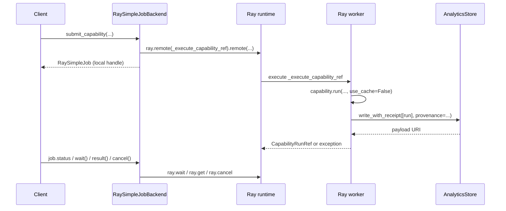

# Ray simple job backend (`kind="ray-simple"`)

`ray-simple` is the lightweight Ray job backend for `checkmaite` jobs:

```python
from checkmaite.jobs import configure_job_backend

configure_job_backend(
    "ray-simple",
    analytics_store={"backend": "parquet", "uri": "./job-results"},
)
```

It submits one Ray task for each capability run and returns a local `RaySimpleJob`
handle. It is intentionally much simpler than the default `ray` job backend.

Use it when you want something easy to understand, easy to debug, and good enough
for local development, demos, notebooks, or simple single-driver workflows. Do
not use it as a durable shared job service.

!!! important
    `ray-simple` trades durability for simplicity. It is often the easiest job
    backend to use for demos and local notebooks, but the submitting client is
    responsible for duplicate-submission policy, crash recovery, and keeping job
    handles alive. If those responsibilities are not acceptable, use the default
    `ray` job backend.

## Practical guidance

For demos and local notebooks, `ray-simple` is often the easiest job backend to
start with. It has fewer moving parts than the default `ray` job backend because
it does not create a shared registry actor or per-job controller actors. That
makes it easier to debug basic worker execution, analytics-store writes, and job
result handling.

The tradeoff is that operational responsibilities move to the user:

- you decide whether duplicate submissions are safe;
- you decide how to recover after a client crash;
- you keep the submitting process alive while using lifecycle APIs;
- you choose durable storage for completed run data;
- you avoid sending very large Python objects through Ray serialization when a
  URI, object-store reference, or other external storage reference would be more
  appropriate.

If those tradeoffs are unacceptable, use the default `ray` job backend instead.

## When to use `ray-simple`

`ray-simple` is a good fit when:

- one Python process or notebook submits and watches the jobs;
- losing job handles after the client exits is acceptable;
- duplicate submissions are acceptable or are handled by your own code;
- you want less job backend machinery while developing or debugging;
- you are running demos or small experiments where operational simplicity matters
  more than durability.

Prefer the default `ray` job backend when:

- jobs must survive notebook or driver restarts;
- another client must list, cancel, or reconnect to existing jobs;
- duplicate submissions must be suppressed by the job backend;
- multiple users or processes share the same Ray cluster;
- you need production-style job tracking on KubeRay or a long-running Ray cluster.

## End-to-end flow



The important difference from the default `ray` backend is that the local
`RaySimpleJobBackend` object owns the remembered job handles. There is no shared
registry and no detached per-job controller actor.

## Public usage

### 1. Configure the job backend

```python
from checkmaite.jobs import configure_job_backend

configure_job_backend(
    "ray-simple",
    address="local",
    analytics_store={"backend": "parquet", "uri": "./analytics_store"},
)
```

### 2. Configure provenance defaults, if needed

```python
from checkmaite import configure_provenance

configure_provenance(user_id="alice@company.com", workspace_id="local-demo")
```

On submission, `ray-simple` reads these defaults from the client process with
`get_provenance_defaults()`, adds dynamic job metadata (`job_id`,
`backend="ray-simple"`, `submitted_at`, and `run_event_id=job_id`), and sends
that resolved provenance directly with the Ray task.

There is no controller in this backend. After `capability.run(...)` finishes,
the worker adds `completed_at` and passes the final provenance explicitly to
`write_with_receipt(...)`. The worker does not recompute client defaults from its
own environment. The auto-generated `runs` rows then persist those values as flat
columns.

### 3. Submit work

```python
from checkmaite.jobs import submit_capability

job = submit_capability(
    capability,
    datasets=[dataset],
    models=[model],
    metrics=[metric],
    config=config,
    use_cache=False,
)
```

`ray-simple` also rejects `use_cache=True`. Job-submission workers are ephemeral
and do not share the client's capability-local cache, so worker execution always
uses `use_cache=False`. Durable reuse should be handled through your analytics
store or by using the registry-backed `ray` backend's idempotent submission
semantics.

### 4. Inspect lifecycle and retrieve the result reference

```python
print(job.job_id)
print(job.status)
print(job.wait(timeout=0.1))

ref = job.result(timeout=300)
print(ref.run_uid)
print(ref.store_uri)
```

### 5. List remembered jobs

```python
from checkmaite.jobs import JobStatus, list_jobs

recent = list_jobs(limit=100)
completed = list_jobs(limit=50, status_filter=JobStatus.COMPLETED)
```

`list_jobs(...)` only lists jobs remembered by the current backend object.

## Status mapping

`RaySimpleJob` maps one Ray task into the shared `JobStatus` protocol:

- first non-ready observation -> `PENDING`
- later non-ready observations -> `RUNNING`
- successful task result -> `COMPLETED`
- Ray task cancellation -> `CANCELLED`
- task exception -> `FAILED`

Ray task readiness does not distinguish queued work from executing work, so the
`PENDING` / `RUNNING` split is a local polling heuristic.

## Assumptions

### Local job identity and recovery

`ray-simple` tracks jobs only in the current `RaySimpleJobBackend` object. If the
notebook, driver, or Python process exits, `list_jobs()`, `get_job(job_id)`,
waiting, and cancellation lose access to those jobs.

Every `submit_capability(...)` call creates a new Ray task. There is no shared
registry, `idempotency_scope`, duplicate suppression, or crash recovery. Use the
default `ray` backend when shared metadata or reattach behavior is required.

### Result storage assumptions

`job.result()` returns a small `CapabilityRunRef`, not the completed capability
run payload. Completed run data is written through the configured analytics
store.

### Runtime and lifecycle assumptions

Status and cancellation are best-effort observations of one Ray task. `cancel()`
issues `ray.cancel(...)`, but Ray cancellation does not guarantee user code or
side effects have not already run. `result()` and `wait()` timeouts do not cancel
the task.

`RaySimpleJobBackend` shares the process Ray runtime: `shutdown(wait=True)` waits
for known jobs and calls `ray.shutdown()`, while `shutdown(wait=False)` returns
without shutting Ray down.
