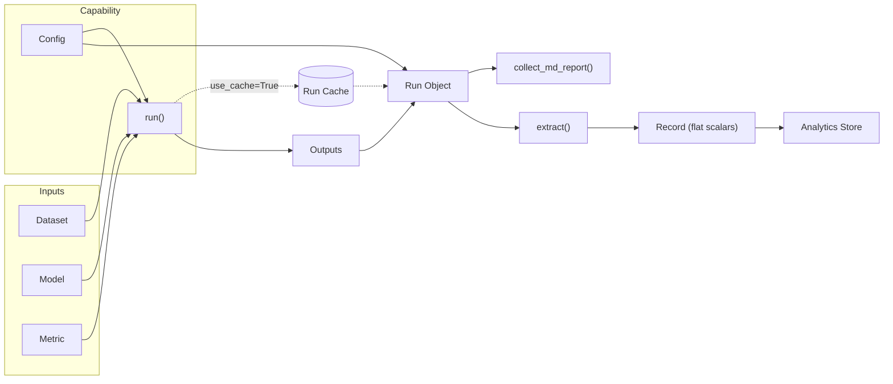
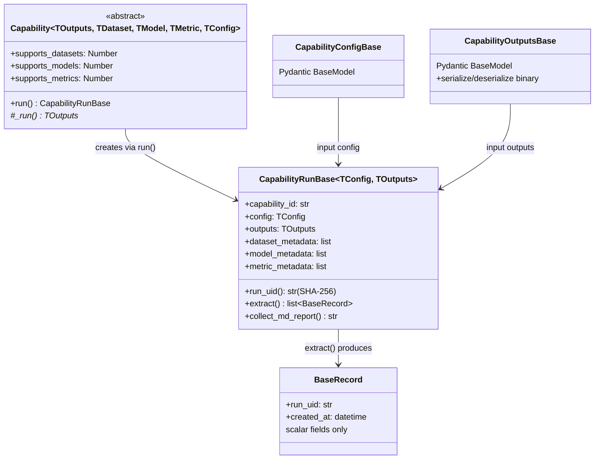
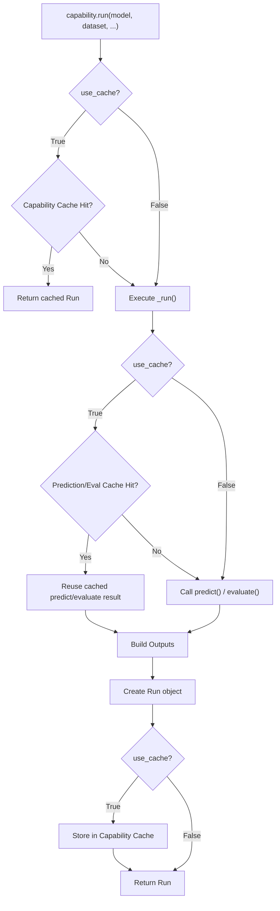
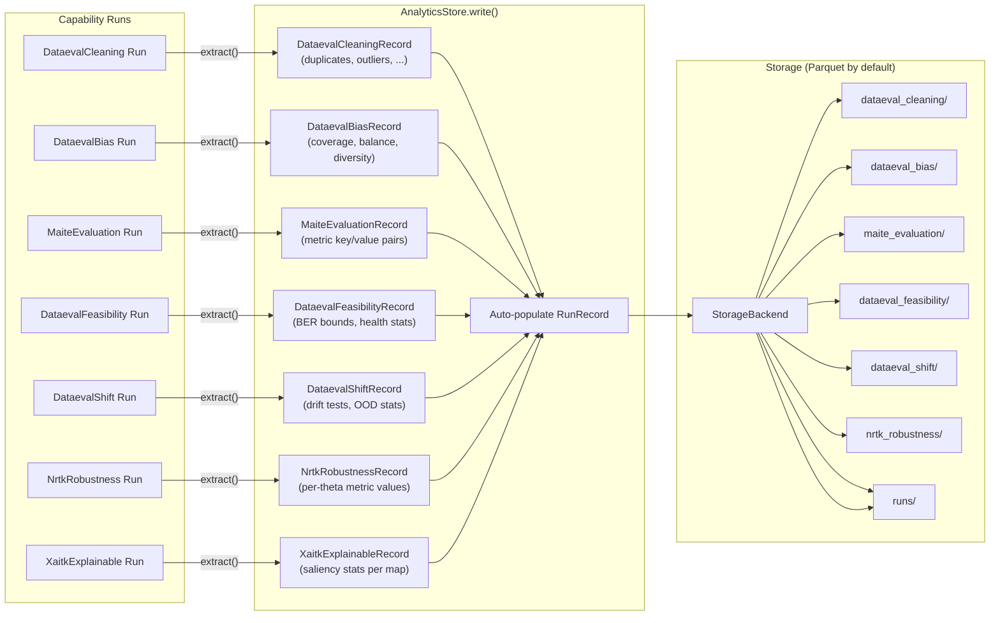

# Key Concepts: Capabilities, Runs, and Caching

This page documents the core abstractions used to define, execute, and cache evaluations: **Capabilities**, **Runs**, and the **caching layer**.

<!-- Top-level flowchart notes (2026-03-20):
     - Shows run() (public API), not _run() (internal abstract method)
     - Cache check happens inside run() before _run() executes — see capability_core.py:363-386
     - Config and Outputs both flow into the Run Object (they are constructor inputs)
     - Simplified: does not show the "store in cache after compute" path (covered in caching flowchart below) -->


---

## Core Concepts

### Capability

A **Capability** represents a specific evaluation task — for example, running model inference and computing metrics on a dataset. It is the top-level abstraction that users interact with.

A Capability is responsible for:

- Defining the **configuration** accepted by the evaluation (via a `Config` object)
- Knowing how to **execute** an evaluation (`_run`)
- Knowing how to **check the cache** before executing (handled by `run`)

---

### Run

A **Run** is an object that stores everything associated with a *specific execution* of a Capability. This includes:

- The **configuration** for that execution (e.g., model, dataset, metric settings)
- The **outputs** produced (e.g., predictions, metric results)
- A method `collect_md_report()` (formerly `collect_report_consumables()`) for generating Markdown reports from those outputs

<!-- Note: The exported name is binary_de_serializer (with underscore), not binary_deserializer. See _cache.py:323. -->
Outputs are serialized using **Pydantic**, which handles conversion of Python objects (numpy arrays, pandas DataFrames, torch tensors, etc.) to bytes for storage in the cache. Custom serialization for additional types can be registered via `binary_de_serializer.register(...)`.

---

### Implementing a New Capability

Each tool must implement:

1. **`Config`** — A Pydantic model declaring what configuration options the Capability accepts. Can be `pass` if no configuration is needed.
2. **`Outputs`** — A Pydantic model declaring what outputs will be stored and cached.
3. **`Run`** — Contains the `Config`, the `Outputs`, and the `collect_md_report()` method for report generation.
4. **Capability class** — aka the "Runner". Implements `_run(...)`, the actual execution logic. Calls internal helpers (e.g., `maite_evaluate`) to produce outputs.

<!-- Class diagram notes (2026-03-20):
     - run_uid is a @cached_property (capability_core.py:140) — shown with () to indicate it's computed
     - Config and Outputs arrows point INTO RunBase (they are inputs, not outputs)
     - collect_md_report() omits the required threshold param for diagram simplicity -->


See the **Baseline Evaluation Capability** for the simplest implementation.

---

## Caching

The caching layer is designed to avoid redundant computation. There are two levels of caching:

<!-- Caching flowchart notes (2026-03-20):
     - Capability-level cache: implemented in capability_core.py:363-386
     - Prediction/eval cache: delegated to each capability's _run() implementation
       via use_prediction_and_evaluation_cache param — not a framework-level mechanism -->


### 1. Capability-level Cache

When a Capability is executed with `use_cache=True` (the default), it checks whether a Run with the same configuration and inputs has already been completed. If a cache hit is found, the stored Run object is returned immediately — no computation occurs.


### 2. Prediction/Evaluation Cache

At a lower level, individual `predict` and `evaluate` calls (e.g., calls to `maite.evaluate`) are also cached globally. If two different Capabilities within the same pipeline call `evaluate` with the same model, dataset, and metric configuration, the second call will reuse the result from the first.

This cache is controlled by the same `use_cache` flag. When `use_cache=False`, both the capability-level and prediction/evaluation-level caches are bypassed.

> **Note:** It is not currently possible to disable the prediction/evaluation cache independently of the capability cache. Both are toggled together via `use_cache`.

---

### Cache Key Generation

<!-- Updated 2026-03-20: Original only listed model_id, dataset_id, metric_id.
     Added capability_id and config per compute_uid() in capability_core.py:130-136. -->
Cache hits are determined by a SHA-256 hash of:
- `capability_id`
- `config` (the full configuration object)
- `dataset_id` (for each dataset)
- `model_id` (for each model)
- `metric_id` (for each metric)

Changing the config or using a different capability will produce a different cache key, even with the same datasets and models. **The IDs are user-supplied metadata fields and must be unique.** The cache does not perform content-based hashing (e.g., checksumming image files) for performance reasons. It is the responsibility of the caller to ensure that IDs accurately reflect the data being passed in.

> ⚠️ **Important:** If you run the same model or dataset under the same ID but with different underlying content, you will get incorrect cache hits. When using this library programmatically (e.g., from a notebook), ensure IDs are managed carefully. In a production environment with a model registry or dataset warehouse, these IDs should be derived automatically from versioned artifacts.

---

### Configuring the Cache

The cache behavior is controlled by the `use_cache` parameter on the Capability's `run` method:

```python
# Use cache (default) — will return cached result if available
capability.run(model=my_model, dataset=my_dataset, use_cache=True)

# Bypass cache — always recompute
capability.run(model=my_model, dataset=my_dataset, use_cache=False)
```

---

## Input Flexibility (Type Coercion)

The checkmaite accepts flexible input types at its public API boundary and normalizes them internally. For example, an image can be passed as:

- A file path (`str` or `Path`)
- Raw bytes
- A `BufferedIOBase` object
- A PIL `Image` object

Internally, all images are normalized to PIL `Image` objects before any processing occurs. This coercion is handled automatically via Pydantic validators and follows [Postel's Law](https://en.wikipedia.org/wiki/Robustness_principle): *be flexible in what you accept, strict in what you emit*.

Similarly, PySpark DataFrames are automatically converted to pandas DataFrames at the boundary.

This means internal code never needs to check input types — it can always assume inputs are in the canonical internal format.

---

## Reporting and Visualization

Each Run exposes a `collect_md_report()` method that prepares outputs for reporting. Report generation is handled by pluggable backends located in the `report/` submodule:

- **Gradient-based reports** (legacy, optional dependency) — generates visual outputs using the Gradient library. Will emit a deprecation warning if used.
- **Markdown reports** — generates a structured `.md` file summarizing outputs. This is the recommended approach going forward.

Both are available as separate functions on the Run object, so end users can choose the format appropriate to their context.

---

## Analytics Store

The analytics store provides persistent, queryable storage for capability results. While the **Run Cache** stores full Python objects for reuse, the **Analytics Store** distills results into flat scalar records that can be queried with SQL.

Each capability can opt in by defining a `Record` class (inheriting from `BaseRecord`) and implementing an `extract()` method on its `Run` class.

<!-- Analytics store diagram: shows all capabilities with extract() support.
     Using <br> instead of \n for mermaid line breaks (cross-renderer compatibility) -->


Records follow these rules:

- **Scalar fields only** — `str`, `int`, `float`, `bool`, `bytes`, `datetime`, or `Optional` variants. No lists, dicts, or nested models.
- **One table per capability** — each `Record` subclass declares a `table_name` (e.g., `"dataeval_cleaning"`).
- **Cross-capability JOINs** — single-dataset capabilities include a `dataset_id` field, enabling queries like:

    ```sql
    SELECT c.exact_duplicate_ratio, f.ber_upper, m.output_value
    FROM dataeval_cleaning c
    JOIN dataeval_feasibility f ON c.dataset_id = f.dataset_id
    JOIN maite_evaluation m ON c.dataset_id = m.dataset_id
    WHERE m.output_key = 'accuracy'
    ```

    Multi-dataset capabilities (e.g., shift) use descriptive ID fields (`reference_dataset_id`, `evaluation_dataset_id`) and can JOIN on either side.

- **Idempotent writes** — records are deduplicated by `run_uid` across write calls.
- **Append-only** — run results are historical facts; no updates or deletes.
- **`created_at`** — auto-populated timestamp on every record; no need to add your own.

To add analytics store support to a new capability, define a `BaseRecord` subclass and implement `extract()` on your `Run` class. See the [reference notebook](../reference/analytics_store_guide.ipynb) for detailed implementation guidance.

For a complete list of available tables and their fields, see the [Record Schema Reference](../reference/analytics_store_guide.ipynb) (Part 5).

For hands-on usage examples (creating a store, writing runs, querying via SQL), see the [Analytics Store Tutorial](../tool-usage/analytics_store_tutorial.ipynb).

---

## Optional Dependencies

UI-related dependencies (Panel, HoloViews, JupyterLab, etc.) are **optional** and not installed by default. This keeps the base package lightweight for use in non-interactive / production environments.
