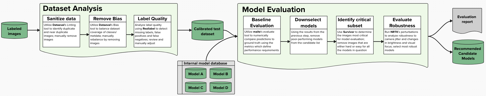

# Persona: Robin

Robin is a T&E Engineer who performs both dataset analysis and model evaluation in object
detection and image classification workflows. 

Robin curates new datasets (which are received pre-labeled) and evaluates 
them for use in production. Robin is also tasked with evaluating which model(s) 
currently available in the organization are most appropriate to use with the 
new datasets. 

Their organization has a defined set of requirements that the models must meet to be approved for 
deployment in their mission. To evaluate candidate models and gather information about what types of 
additional data is needed for re-training, Robin uses a set of automated testing pipelines developed 
using JATIC tools that their organization has customized to their specific needs.

## Robin's Resume
- Undergraduate degree in Mathematics, Master's degree in Data Science
- 3 years T&E experience in the DoD
- Knowledgeable in Python, and MATLAB, but not trained as a computer scientist.

## Project

Robin's current project is focused on running object detection models against aerial images taken from 
aircraft to detect planes on the ground. Robin's role is two-fold. First, the project has undertaken
a data collection effort to generate a new, focused dataset for the project. Robin's role is to 
curate the dataset (which they receive pre-labeled) and evaluate it for use in the project. 

As part of curation, she will be ensuring the dataset is of high quality. This will include:
* Removal of images that are too dark, blurry, or obscured
* Ensuring proper distribution across classes of interest to the project (no biases or improper 
correlations)

She must also ensure that the dataset encompasses the operational design domain (ODD) for the project
(i.e. the dataset was collected in the proper environment and conditions as appropriate for the model)

Second, the project has access to several models that were trained for a similar, but slightly different 
use case. The current project is time-sensitive and the team has limited ability to retrain a model. 
The project lead has tasked Robin with evaluating which, if any, of the pre-trained models
would be most appropriate for the project. The team will likely only have enough time during the project
to retrain one model, therefore they will select the most optimal model that Robin finds as the primary
candidate for fine tuning.

## External collaboration

* Program Office/Stakeholders & Systems Engineer/SME - define the use case for the project and define risks and requirements
* Data Collection Engineer - collects raw data and labels it before handing it off
* Model Developer - trains production models for the project

## Workflow

Robin's workflow is summarized below. 

