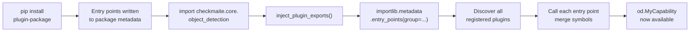
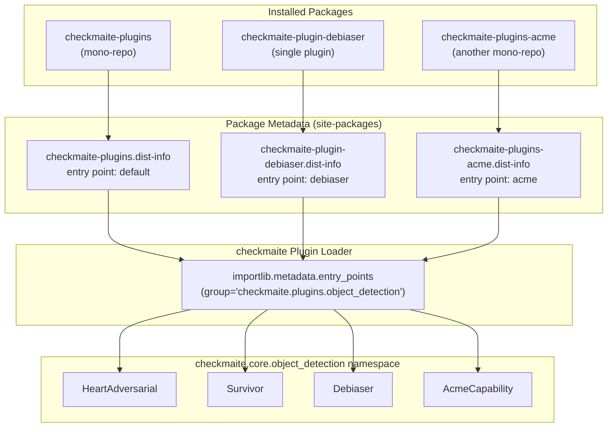
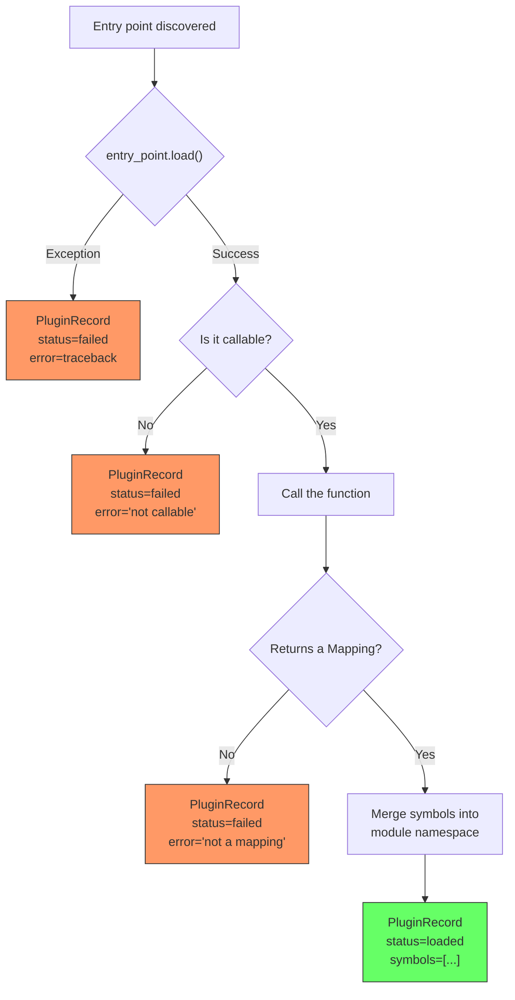
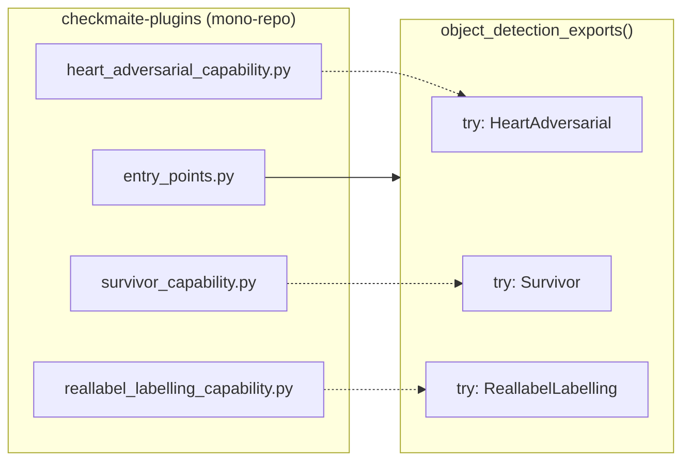
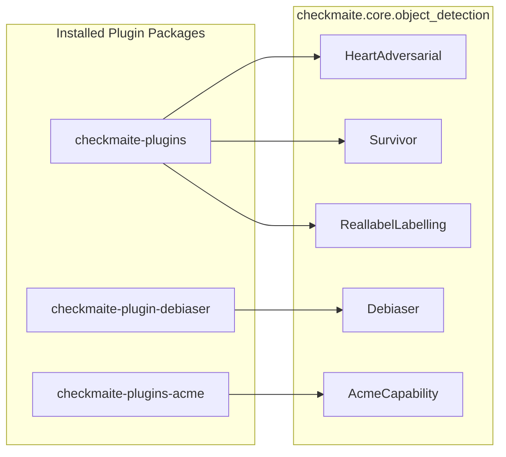

# Plugin System

checkmaite uses a plugin architecture to support capabilities with heavy or optional dependencies. Plugins are discovered automatically at runtime via Python's [entry point](https://packaging.python.org/en/latest/specifications/entry-points/) mechanism — any installed package that registers under the correct group is picked up without changes to the core repository.

## How It Works

When `checkmaite.core.object_detection` or `checkmaite.core.image_classification` is imported, the module calls `inject_plugin_exports()` which:

1. Scans **all installed packages** for entry points registered under the group (e.g., `checkmaite.plugins.object_detection`)
2. Calls each entry point function, which returns a dict of capability classes
3. Merges those classes into the module namespace and `__all__`
4. Records the outcome in a registry for diagnostics



## Plugin Discovery Architecture

The loader scans all installed packages — it does not hardcode any specific plugin. This means single-plugin repos, mono-repos, and any combination work automatically. We currently maintain a mono-repo with currently unsupported plugins, [`checkmaite-plugins`](https://gitlab.jatic.net/jatic/orchestration-interoperability/checkmaite-plugins). However, let's say you would like to add your own plugins — one as a single-plugin repo called "debiaser" and one as a mono-repo of plugins called "acme". Here is an example of how those would work together:



## Plugin Load Lifecycle

Each entry point goes through validation before its symbols are accepted:



## The Official Plugin Package

The [`checkmaite-plugins`](https://gitlab.jatic.net/jatic/orchestration-interoperability/checkmaite-plugins) repository is a mono-repo containing capabilities that depend on packages not available on Python 3.12+ or that require Java/private dependencies:

- **HeartAdversarial** (object detection) — adversarial robustness via HEART library
- **ReallabelLabelling** (object detection) — labelling via RealLabel + PySpark
- **Survivor** (object detection + image classification) — survivability analysis

Install via the `unsupported` extra in checkmaite:

```bash
poetry install --extras unsupported
```

Or directly:

```bash
pip install "checkmaite-plugins[unsupported]"
```

## Creating a Plugin

A plugin is any Python package that:

1. Declares entry points under `checkmaite.plugins.object_detection` and/or `checkmaite.plugins.image_classification`
2. Provides a callable that returns a `Mapping[str, Any]` of capability class names to classes

### Minimal Example: Single-Capability Plugin

```
checkmaite-plugin-debiaser/
    pyproject.toml
    src/
        checkmaite_plugin_debiaser/
            __init__.py
            capability.py
```

**pyproject.toml:**

```toml
[project]
name = "checkmaite-plugin-debiaser"
version = "0.1.0"
requires-python = ">=3.10, <3.13"

[project.entry-points."checkmaite.plugins.image_classification"]
debiaser = "checkmaite_plugin_debiaser:ic_exports"

[tool.poetry.dependencies]
checkmaite = ">=0.2.0"
```

The entry point name (`debiaser`) is an identifier — it can be anything. The value points to a callable using `module:function` syntax.

**src/checkmaite_plugin_debiaser/\_\_init\_\_.py:**

```python
from collections.abc import Mapping
from typing import Any


def ic_exports() -> Mapping[str, Any]:
    from checkmaite.core._plugins import PLUGIN_API_VERSION
    from checkmaite_plugin_debiaser.capability import (
        Debiaser,
        DebiaserConfig,
        DebiaserOutputs,
    )
    return {
        "__plugin_api_version__": PLUGIN_API_VERSION,
        "Debiaser": Debiaser,
        "DebiaserConfig": DebiaserConfig,
        "DebiaserOutputs": DebiaserOutputs,
    }
```

**capability.py** would contain your `Capability` subclass following the standard checkmaite [capability pattern](key_concepts.md).

Once installed (`pip install checkmaite-plugin-debiaser`), the capability is automatically available:

```python
import checkmaite.core.image_classification as ic
ic.Debiaser  # available without any changes to checkmaite
```

### Mono-Repo Plugin (Multiple Capabilities)

A single package can register multiple capabilities. See [`checkmaite-plugins`](https://gitlab.jatic.net/jatic/orchestration-interoperability/checkmaite-plugins) for the reference implementation.



The key difference is the entry point function returns multiple classes, and wraps each import in try/except for graceful degradation:

```python
def object_detection_exports() -> Mapping[str, Any]:
    from checkmaite.core._plugins import PLUGIN_API_VERSION

    exports: dict[str, Any] = {"__plugin_api_version__": PLUGIN_API_VERSION}

    try:
        from my_plugin.heart_capability import HeartAdversarial, HeartAdversarialConfig
        exports["HeartAdversarial"] = HeartAdversarial
        exports["HeartAdversarialConfig"] = HeartAdversarialConfig
    except ImportError:
        pass  # heart-library not installed, skip

    try:
        from my_plugin.survivor_capability import Survivor, SurvivorConfig
        exports["Survivor"] = Survivor
        exports["SurvivorConfig"] = SurvivorConfig
    except ImportError:
        pass  # survivor not installed, skip

    return exports
```

### Entry Point Contract

| Requirement | Detail |
|---|---|
| Group name | `checkmaite.plugins.object_detection` or `checkmaite.plugins.image_classification` |
| Entry point value | A callable (function) taking no arguments |
| Return type | `Mapping[str, Any]` — keys are symbol names, values are **classes** (not instances) |
| `__plugin_api_version__` | **Required.** Must be a semver string (e.g., `"1.0.0"`). Major version must match checkmaite's `PLUGIN_API_VERSION`. |
| Error handling | Wrap imports in `try/except ImportError` for optional deps |
| Core dependency | `checkmaite >= 0.2.0` must be a dependency of your plugin |

### API Version Compatibility

checkmaite uses semver for plugin API versioning. The current API version is available as:

```python
from checkmaite.core._plugins import PLUGIN_API_VERSION
```

**Rules:**

- Plugins **must** include `"__plugin_api_version__"` in their exports mapping
- The **major version** must match checkmaite's `PLUGIN_API_VERSION`
- Minor and patch differences are allowed (a `1.0.0` plugin works with a `1.2.0` core)
- If the major version does not match, the plugin is rejected and will not load

**When does the major version bump?**

Only when the Capability/Config/Outputs contract changes in a breaking way (e.g., `_run()` signature changes, required base class methods added or removed). This is expected to be rare.

**Best practice:** Import `PLUGIN_API_VERSION` from checkmaite rather than hardcoding a string. This way your plugin always declares the version it was built against:

```python
from checkmaite.core._plugins import PLUGIN_API_VERSION

def my_exports() -> Mapping[str, Any]:
    return {"__plugin_api_version__": PLUGIN_API_VERSION, ...}
```

## Multiple Plugins Coexisting

Any number of plugin packages can be installed simultaneously. The loader discovers and merges all of them:



All symbols appear in `checkmaite.core.object_detection` or `checkmaite.core.image_classification` as if they were built-in.

If two plugins export the same symbol name, the last one loaded wins and a warning is logged.

## Diagnostics

Use `list_loaded_plugins()` to see what loaded:

```python
from checkmaite.core._plugins import list_loaded_plugins

for record in list_loaded_plugins():
    print(f"[{record.status}] {record.entry_point_name} from {record.package_name}")
    print(f"  symbols: {record.symbols}")
    if record.error:
        print(f"  error: {record.error}")
```

Filter by group:

```python
od_plugins = list_loaded_plugins(group="checkmaite.plugins.object_detection")
ic_plugins = list_loaded_plugins(group="checkmaite.plugins.image_classification")
```

Each `PluginRecord` contains:

| Field | Type | Description |
|---|---|---|
| `group` | `str` | Entry point group name |
| `entry_point_name` | `str` | Name from pyproject.toml |
| `package_name` | `str \| None` | Installed package name |
| `symbols` | `list[str]` | Capability names contributed |
| `status` | `"loaded" \| "failed"` | Whether the entry point loaded |
| `error` | `str \| None` | Error message if failed |

## Testing Your Plugin

Verify your plugin registers correctly after installation:

```python
import checkmaite.core.object_detection as od  # or image_classification

# Check your symbols are available
assert hasattr(od, "MyCapability")
assert hasattr(od, "MyCapabilityConfig")

# Check the registry
from checkmaite.core._plugins import list_loaded_plugins
records = list_loaded_plugins()
my_records = [r for r in records if r.package_name == "my-plugin-package"]
assert len(my_records) == 1
assert my_records[0].status == "loaded"
```
