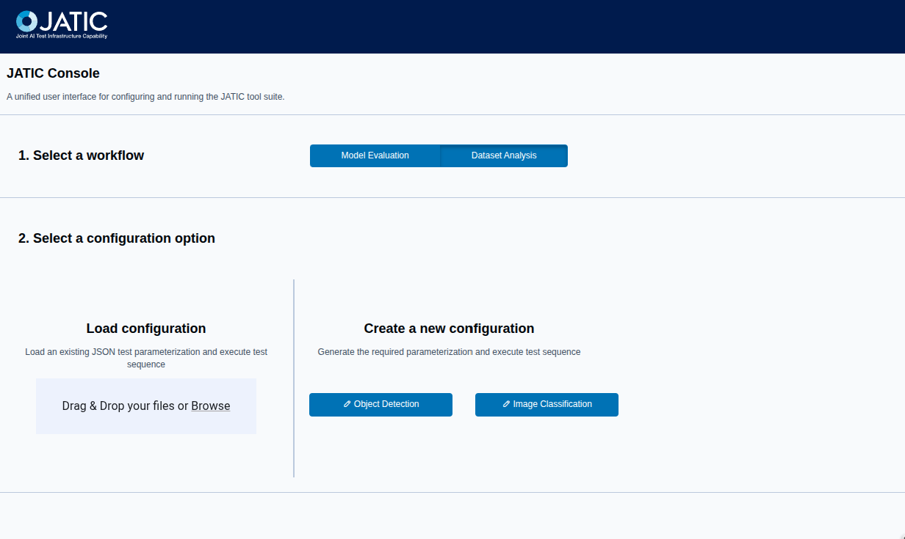
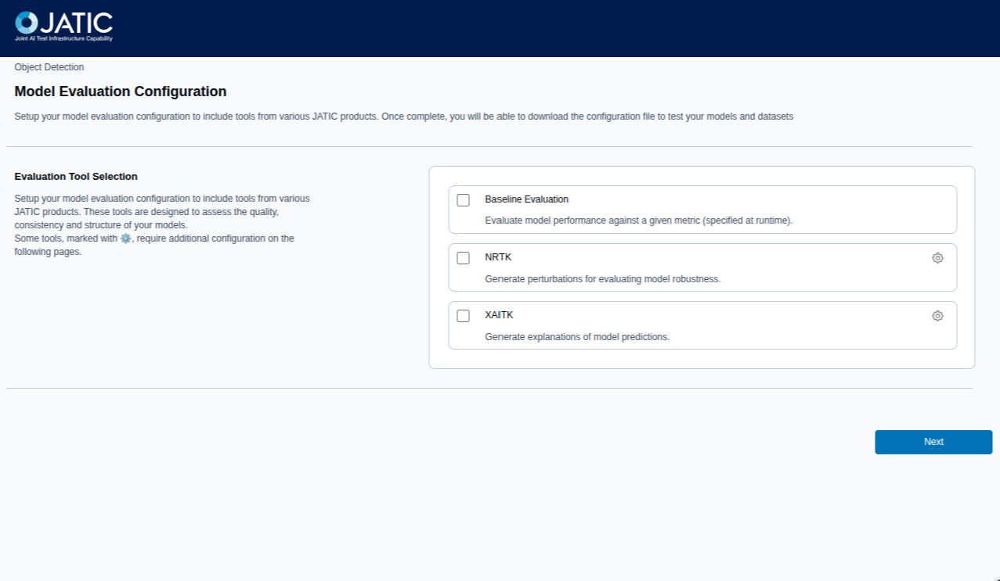
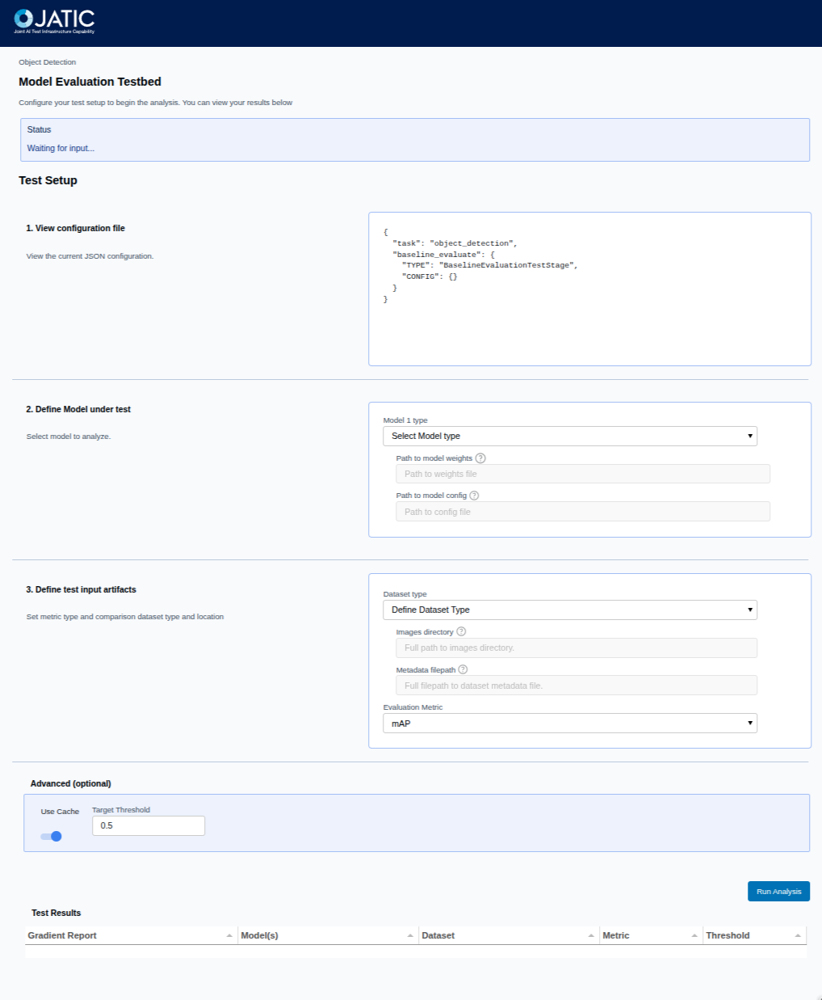

# Running checkmaite interactively

We've streamlined the process of running `checkmaite`
interactively. This allows you to explore and utilize the full capabilities of `checkmaite` workflows through a user-friendly web interface (UI).

To run checkmaite, we recommend setting up a virtual environment and installing
the necessary dependencies, for detailed instructions, please refer to the [Setup
Guide](./install_setup.md).


Once you have the environment set up, you can start `checkmaite` by running the
following command in your terminal:

```bash
poetry run panel serve src/checkmaite/ui/app.py --show
```

</details>
If running a conda environment, you can replace the need for `poetry run` with `conda run -n <env_name> --live-stream`,
or if the environment is activated, you can simply use:

```bash
python panel serve src/checkmaite/ui/app.py --show
```
</details>

This command will launch checkmaite in your default web browser under
`http://localhost:5006/app`. If this port is in use, you can also specify the port, for example, `--port 9000`. You can
then interact with the application and run workflows directly from
the web interface.

## Interactive UI workflow

The first step is to select which workflow you would like to work with:

- *Model Evaluation (ME)* to analyze model performance, robustness, and explainability using the JATIC tools [MAITE](https://mit-ll-ai-technology.github.io/maite/), [NRTK](https://nrtk.readthedocs.io/en/latest/tutorials/testing_and_evaluation_notebooks.html), and XAITK respectively.
- *Dataset Analysis (DA)* to understand and improve dataset quality by analyzing data biases, feasibility, shift, and cleaning statistics using the JATIC tool Dataeval.

All of these tools are available for both Image Classification (IC) and Object Detection (OD) tasks.



You can then select the desired workflow, and either load a pre-configured workflow parametrization JSON file or you can create a new configuration for this workflow.

Each configuration page will guide you through the necessary steps to set up the
workflow including any parameters
required for the workflow execution. Below is an example of the Model Evaluation (ME)
landing page, where you select which tools you would like to use:


At end end of the configuration pipeline you
will be presented
with a summary of the configuration as a JSON block, and the options to select the model
and datasets to use for the workflow.

You can then run the workflow by clicking the "Run analysis"
button. The application will then execute the workflow and generate a report with the results.


The Dataset Analysis workflow works in the same manner with different JATIC tools available.

For detailed information on how each tool is configured and operates, refer to the individual pages in the `checkmaite` documentation or the original tool’s documentation.
